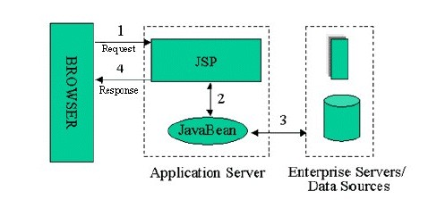
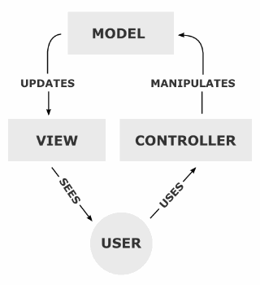

#angular js mvc partten 

## 개념 
- Model / View / Controller 의 약자로 software achitecher 개발 방법 중 하나

## 특징  
- 하나의 기능을 모듈화하여 가독성 및 재사용성을 높임
- 소수의 뛰어난 엔지니어들이 해결한 문제를 다수의 엔지니어들이 처리할 수 있도록 함으로써, 개발자들간의 커뮤니케이션 효용성을 높임

## model1 vs model2(mvc) 
 - http://wiki.javajigi.net/pages/viewpage.action?pageId=73 의 내용을 참고하였음

### model1 



장점 : 
 - Model 1개발 방식은 현재 국내에서 가장 많이 사용되고 있는 개발 방식
 - 페이지 별로 개발하기 때문에 단순함.(ex : JSP / Servlet, PHP, ASP 등)
 - 개발 속도가 빠르다.
 - 개발자의 스킬이 낮아도 배우기 쉬워 빠르게 적용

단점 :
 - 페이지에서 프리젠테이션 로직 / 비즈니스 로직을 모두 포함하므로 페이지가 너무 복잡해 진다.
 - 프리젠테이션 로직 / 비즈니스 로직이 혼재되어 있기 때문에 개발자와 디자이너의 분리된 작업이 어려워진다.
 - 페이지의 코드가 복작해 짐으로 인해 유지보수 하기 어려워진다.

### model2



장점 : 
 - Model 1 개발 방식의 단점들을 보완하였음.
 - 프리젠테이션 로직 / 비즈니스 로직을 분리하므로 기능별로 모듈화함
 - 개발자와 디자이너간의 작업이 용이하다.
 - 코드가 단순해 짐으로 인해 유지보수가 용이하다.

단점 : 
 - 소프트웨어 공학 partten 개념을 이해하여야 함(배우기 어려움 : 모르는 사람에게는 model1보다 복잡해 보일 수 있음)
 - 개발 속도가 model1보다는 느리다.(그러나 익숙해지면 model1보다 빠르다.)


## MVC 구성 및 흐름도 
 - https://opentutorials.org/course/697/3828 의 내용을 참고하였음

 ### 예제
1. 사용자가 웹사이트에 접속한다. (Uses)
2. Controller는 사용자가 요청한 웹페이지를 서비스 하기 위해서 모델을 호출한다. (Manipulates)
3. 모델은 데이터베이스나 파일과 같은 데이터 소스를 제어한 후에 그 결과를 리턴한다.
4. Controller는 Model이 리턴한 결과를 View에 반영한다. (Updates)
5. 데이터가 반영된 VIew는 사용자에게 보여진다. (Sees)

 ### 설명

Controller 
 - 사용자가 접근 한 URL에 따라서 사용자의 요청사항을 파악한 후에 그 요청에 맞는 데이터를 Model에 의뢰하고, 데이터를 View에 반영해서 사용자에게 알려준다. 

Model
 - 일반적으로 CI(CodeIgniter)의 모델은 데이터베이스 테이블에 대응된다. 이를테면 Topic이라는 테이블은 topic_model이라는 Model을 만든다. 그런데 이 관계가 강제적이지 않기 때문에 규칙을 일관성 있게 정의하는 것이 필요하다.

View 
 - View는 클라이언트 측 기술인 html/css/javascript들을 모아둔 컨테이너이다. 

### 소스코드를 통한 mvc 규칙
 - http://soomong.net/blog/2014/01/20/translation-ultimate-guide-to-learning-angularjs-in-one-day/ 를 참조

url 
```
/angular/test1.do
```

controller
```
<script>
	//angular js 모듈 정의
	var myApp = angular.module('myApp', []);
	
	//controller 정의
    	myApp.controller('MathCtrl', ['$scope', 'Math', function ($scope, Math) {
	    var a = 12;
	    var b = 24;

	    // 결과는 288
		$scope.result = Math.multiply(a, b);
	}]);
	...
</script>
```

model
```
<script>
	...
	myApp.service('Math', function () {
	  this.multiply = function (x, y) {
	    return x * y;
	  };
	});
	...
</script>
```

view 
```
<html>
<div ng-controller="MathCtrl">
	{{ result }}
</div>
</html>
```

소스 전체 
```
<!DOCTYPE html>
<html>
<head>
<title>test</title>
<script type="text/javascript" src="/sti/js/jquery-1.11.3.js"></script>
<script type="text/javascript" src="/sti/js/jquery-migrate-1.2.1.js"></script>
<script type="text/javascript" src="/sti/js/angular.js"></script>
<script>
	//angular js 모듈 정의
	var myApp = angular.module('myApp', []);
	
	// Math
	myApp.service('Math', function () {
	  this.multiply = function (x, y) {
	    return x * y;
	  };
	});
	
	/*$scope - application 모델을 나타내는 angular js의 기본 객체*/
	myApp.controller('MathCtrl', ['$scope', 'Math', function ($scope, Math) {
	    var a = 12;
	    var b = 24;

	    // 결과는 288
	    $scope.result = Math.multiply(a, b);
	}]);
</script>
</head>
<body>
  <div ng-app="myApp">
    <div ng-controller="MathCtrl">
        {{ result }}
    </div>
  </div>
</body>
</html>
```
결과

[예제](http://codepen.io/skypentum/pen/YyoNwM)
