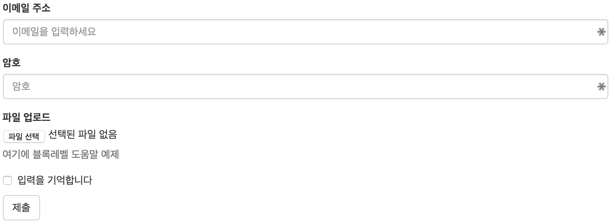

# Form

작성자 : 이기섭

작성일 : 2015-12-19


### 기본 예제

각각의 폼 컨트롤은 자동적으로 약간의 전역 스타일을 받게 받게 됩니다. `.form-control`에 있는 모든 텍스트 형식의 `<input>`, `<textarea>`, `<select>`는 기본으로 width를 100%로 정해집니다. 최적의 여백을 위해 라벨들과 콘트롤들은 `.form-group`으로 묶어야 합니다.



[예제](http://codepen.io/luensys/pen/GoZwYj?editors=100)
```html
<form>
  <div class="form-group">
    <label for="exampleInputEmail1">이메일 주소</label>
    <input type="email" class="form-control" id="exampleInputEmail1" placeholder="이메일을 입력하세요">
  </div>
  <div class="form-group">
    <label for="exampleInputPassword1">암호</label>
    <input type="password" class="form-control" id="exampleInputPassword1" placeholder="암호">
  </div>
  <div class="form-group">
    <label for="exampleInputFile">파일 업로드</label>
    <input type="file" id="exampleInputFile">
    <p class="help-block">여기에 블록레벨 도움말 예제</p>
  </div>
  <div class="checkbox">
    <label>
      <input type="checkbox"> 입력을 기억합니다
    </label>
  </div>
  <button type="submit" class="btn btn-default">제출</button>
</form>
```
```
form-group과 input-group을 같이 쓰지 마세요.
form-group과 input-group을 직접 같이 쓰지 마세요. 대신 input-group은 form-group 안에 쓰세요.
```

### 인라인 폼

좌측으로 정렬하기 위해서는 `form-inline`을 추가하세요. 단, 이것은 최소 768px의 뷰포트 내의 폼에만 적용됩니다.

맞춤 너비가 필요할 수 이습니다.  
입력 콘트롤이나 셀렉트 콘트롤은 부트스트랩에서 기본적으로 `width:100%`가 적용되어 있습니다.  
인라인 폼 내에서는 이 것을 `width: auto;`로 초기화 하여 몇 개의 콘트롤들을 같은 줄에 있도록 할 수 있습니다.  
레이아웃에 따라 추가적인 맞춤 너비가 필요할 수 있습니다.  


언제나 라벨을 추가하세요.  
스크린 리더는 input 라벨을 포함하지 않을 경우 문제가 생길 수 있습니다.  
인라인 폼을 위해서 `.sr-only`를 사용하여 라벨을 숨길 수 있습니다.  
보조적인 방법으로 `area-label`, `aria-labelledby`, `title`이 있습니다.  
이런 것들이 존재하지 않는다면 스크린 리더는 `placeholder` 속성에 의지할 수 밖에 없으나,  
`placeholder`로 다른 라벨링을 대체하는 것은 권장하지 않습니다.  


[예제](http://codepen.io/luensys/pen/JGEZwK?editors=100)

```html
<form class="form-inline">
  <div class="form-group">
    <label for="exampleInputName2">Name</label>
    <input type="text" class="form-control" id="exampleInputName2" placeholder="Jane Doe">
  </div>
  <div class="form-group">
    <label for="exampleInputEmail2">Email</label>
    <input type="email" class="form-control" id="exampleInputEmail2" placeholder="jane.doe@example.com">
  </div>
  <button type="submit" class="btn btn-default">Send invitation</button>
</form>
```

### 수평 폼
폼에 `.form-horizontal`을 추가하여 라벨들과 폼 컨트롤을 미리 정의된 그리드 클래스로 조절이 가능합니다.  
그리드행 역할은 `.form-group`이 하기 때문에 `.row`는 필요가 없습니다.


[예제](http://codepen.io/luensys/pen/BjpPLv?editors=100)
```html
<form class="form-horizontal">
  <div class="form-group">
    <label for="inputEmail3" class="col-sm-2 control-label">Email</label>
    <div class="col-sm-10">
      <input type="email" class="form-control" id="inputEmail3" placeholder="Email">
    </div>
  </div>
  <div class="form-group">
    <label for="inputPassword3" class="col-sm-2 control-label">Password</label>
    <div class="col-sm-10">
      <input type="password" class="form-control" id="inputPassword3" placeholder="Password">
    </div>
  </div>
  <div class="form-group">
    <div class="col-sm-offset-2 col-sm-10">
      <div class="checkbox">
        <label>
          <input type="checkbox"> Remember me
        </label>
      </div>
    </div>
  </div>
  <div class="form-group">
    <div class="col-sm-offset-2 col-sm-10">
      <button type="submit" class="btn btn-default">Sign in</button>
    </div>
  </div>
</form>
```

### 지원되는 컨트롤 들

#####입력들

아래의 타입들을 모두 지원합니다.(HTML5)

`text`, `password`, `datetime`, `datetime-local`, `date`, `month`, `time`, `week`, `number`, `email`, `url`, `search`, `tel`, `color`

```
입력은 type이 제대로 선언된 경우에만 스타일 됩니다.
```

[예제](http://codepen.io/luensys/pen/EPZpdv?editors=100)
아래의 예제는 type을 바꿔보기 위해 간단하게 작성하였습니다.

```html
<input type="month" class="form-control" placeholder="Text input">
```

