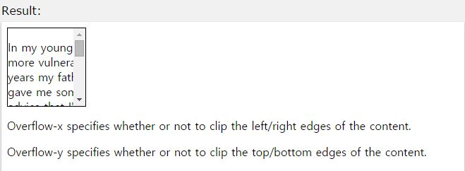

## overflow-y

작성자 : 김동일

작성일 : 2015-10-30

css 레퍼런스 설명:
 - overflow-y : div 영역이 overflow가 될 시 세로축에 대한 처리를 정의한다.

 - syntax :
```sh
overflow-y: visible|hidden|scroll|auto|initial|inherit;
```

visible : div 영역에 따라 overflow 발생 시 div 영역 외부에 scroll이 활성화된다.

hidden : 스크롤 여부에 상관 없이 가로축 scroll이 비활성화 된다.

scroll : 스크롤 여부에 상관 없이 가로축 scroll이 활성화 된다.

auto : div 영역에 따라 overflow 발생 시 scoll이 활성화 된다.

initial:기본 값으로 set되어 있는 값을 불러온다.(normal)

inherit:부모 element에 설정되어 있는 값을 상속 받는다.

sample code :
```html
<!DOCTYPE html>
<html>
<head>
<style>
div {
    width: 110px;
    height: 110px;
    border: thin solid black;
    overflow-x: hidden;
    overflow-y: auto;
}
</style>
</head>
<body>

<div><p style="width:140px">
In my younger and more vulnerable years my father gave me some advice that I've been turning over in my mind ever since.
'Whenever you feel like criticizing anyone,' he told me, 'just remember that all the people in this world haven't had the advantages that you've had.'
</p></div>

<p>Overflow-x specifies whether or not to clip the left/right edges of the content.</p>
<p>Overflow-y specifies whether or not to clip the top/bottom edges of the content.</p>

</body>
</html>
```

결과




-----

* [CSS3 README](../README.md)

* [overflow-wrap](overflow-wrap.md)
* [overflow-x](overflow-x.md)
* [overflow-y](overflow-y.md)
