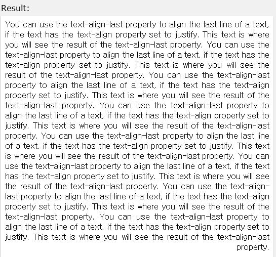

## text-align-last

작성자 : 김동일

작성일 : 2015-10-30

css 레퍼런스 설명: 
 - text-align-last : 문자의 마지막 라인 방향을 정의한다.
 
 - syntax : 
```sh 
text-align-last: auto|left|right|center|justify|start|end|initial|inherit;
```

auto : 기본 값, 문자의 마지막 라인을 왼쪽에 정렬한다.

left : 문자의 마지막 라인을 왼쪽에 정렬한다.

right : 문자의 마지막 라인을 왼쪽에 정렬한다. 

center : 문자의 마지막 라인을 가운데에 정렬한다. 

justify : div 크기에 따라 문자의 마지막 라인을 정렬한다.

start : text-direction에 정의되어 있는 것에 따라 정렬한다.

end : text-direction에 정의되어 있는 것의 역으로 정렬한다.

initial:기본 값으로 set되어 있는 값을 불러온다.

inherit:부모 element에 설정되어 있는 값을 상속 받는다.

sample code : 
```sh
<!DOCTYPE html>
<html>
<head>
<style>
div {
    text-align: justify;
    -moz-text-align-last: right; /* Code for Firefox */
    text-align-last: right;
}
</style>
</head>
<body>

<div>
You can use the text-align-last property to align the last line of a text, if the text has the text-align property set to justify. This text is where you will see the result of the  text-align-last property. You can use the text-align-last property to align the last line of a text, if the text has the text-align property set to justify. This text is where you will see the result of the  text-align-last property.
You can use the text-align-last property to align the last line of a text, if the text has the text-align property set to justify. This text is where you will see the result of the  text-align-last property.
You can use the text-align-last property to align the last line of a text, if the text has the text-align property set to justify. This text is where you will see the result of the  text-align-last property.
You can use the text-align-last property to align the last line of a text, if the text has the text-align property set to justify. This text is where you will see the result of the  text-align-last property.
You can use the text-align-last property to align the last line of a text, if the text has the text-align property set to justify. This text is where you will see the result of the  text-align-last property.
You can use the text-align-last property to align the last line of a text, if the text has the text-align property set to justify. This text is where you will see the result of the  text-align-last property.
You can use the text-align-last property to align the last line of a text, if the text has the text-align property set to justify. This text is where you will see the result of the  text-align-last property.
</div>

<p><strong>Note:</strong> The text-align-last property currently only works in Internet Explorer and Firefox.</p>

</body>
</html>

```

결과 



chrome, safari, opera 에서는 지원하지 않음

### 목록
* [align-content](align-content.md)
* [align-items](align-items.md)
* [align-self](align-self.md)
* [@keyframes](@keyframes.md)
* [animation](animation.md)
* [animation-name](animation-name.md)
* [animation-duration](animation-duration.md)
* [animation-timing-function](animation-timing-function.md)
* [animation-delay](animation-delay.md)
* [animation-iteration-count](animation-iteration-count.md)
* [animation-direction](animation-direction.md)
* [animation-play-state](animation-play-state.md)
* [backface-visibility](backface-visibility.md)
* [background-clip](background-clip.md)
* [background-origin](background-origin.md)
* [background-size](background-size.md)
* [border-bottom-left-radius](border-bottom-left-radius.md)
* [border-bottom-right-radius](border-bottom-right-radius.md)
* [border-image](border-image.md)
* [border-image-outset](border-image-outset.md)
* [border-image-repeat](border-image-repeat.md)
* [border-image-slice](border-image-slice.md)
* [border-image-source](border-image-source.md)
* [border-image-width](border-image-width.md)
* [border-radius](border-radius.md)
* [border-top-left-radius](border-top-left-radius.md)
* [border-top-right-radius](border-top-right-radius.md)
* [box-shadow](box-shadow.md)
* [box-sizing](box-sizing.md)
* [column-count](column-count.md)
* [column-gap](column-gap.md)
* [column-rule](column-rule.md)
* [column-rule-color](column-rule-color.md)
* [column-rule-style](column-rule-style.md)
* [column-rule-width](column-rule-width.md)
* [column-span](column-span.md)
* [column-width](column-width.md)
* [columns](columns.md)
* [flex](flex.md)
* [flex-basis](flex-basis.md)
* [flex-direction](flex-direction.md)
* [flex-flow](flex-flow.md)
* [flex-grow](flex-grow.md)
* [flex-shrink](flex-shrink.md)
* [flex-wrap](flex-wrap.md)
* [@font-face](@font-face.md)
* [font-feature-settings](font-feature-settings.md)
* [hyphens](hyphens.md)
* [justify-content](justify-content.md)
* [opacity](opacity.md)
* [order](order.md)
* [outline-offset](outline-offset.md)
* [overflow-wrap](overflow-wrap.md)
* [overflow-x](overflow-x.md)
* [overflow-y](overflow-y.md)
* [perspective](perspective.md)
* [perspective-origin](perspective-origin.md)
* [resize](resize.md)
* [tab-size](tab-size.md)
* [text-align-last](text-align-last.md)
* [text-overflow](text-overflow.md)
* [text-shadow](text-shadow.md)
* [transform](transform.md)
* [transform-origin](transform-origin.md)
* [transform-style](transform-style.md)
* [transition](transition.md)
* [transition-delay](transition-delay.md)
* [transition-duration](transition-duration.md)
* [transition-property](transition-property.md)
* [transition-timing-function](transition-timing-function.md)
* [word-break](word-break.md)
* [word-wrap](word-wrap.md)