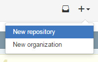
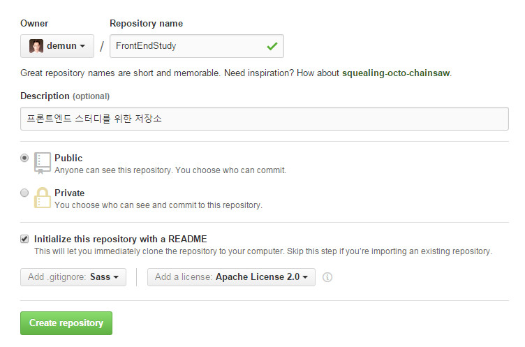
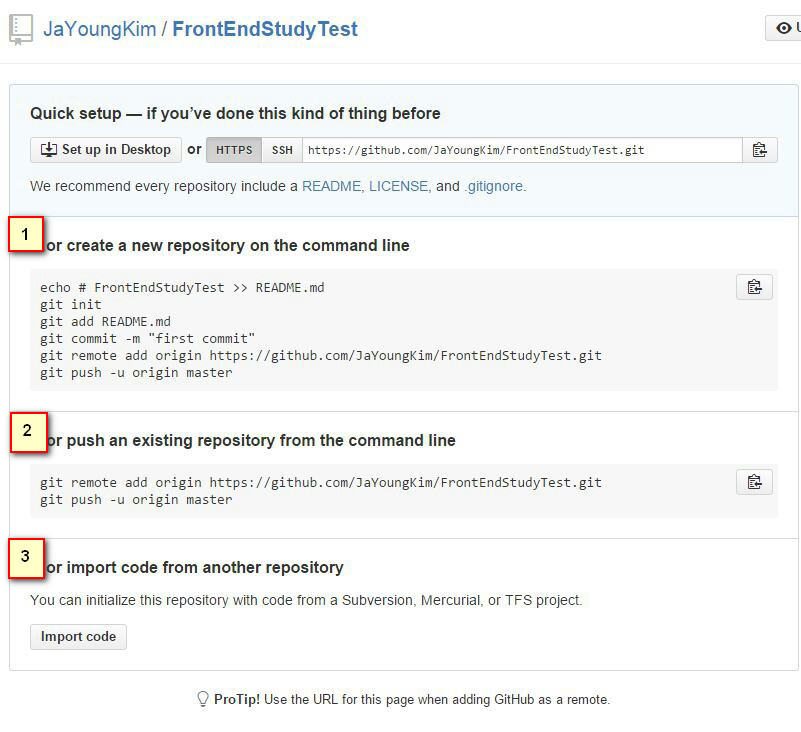
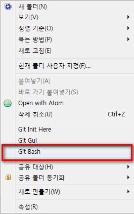
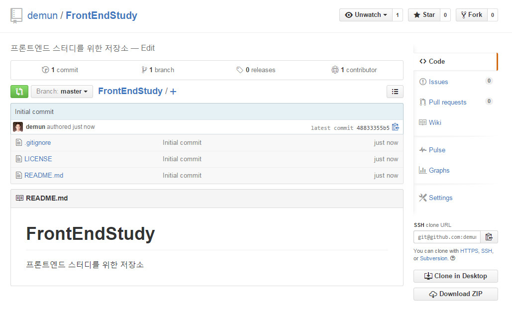

# 04-저장소-만들기


#### 1. 원격저장소에서 `+` 아이콘을 클릭해서 New repository를 클릭해서 새로운 저장소를 만듭니다.



#### 2. 이름과 설명을 적어줍니다.




#### 3. `README` 파일과 `.gitignore` 와 `license` 파일도 만듭니다. 이건 옵션으로써 만들어도되고 안만들어도 됩니다.


#### 4. 다음 `Create repository` 를 클릭해서 저장소 옵션을 마무리하고 저장소를 만듭니다.

맨처음 저장소를 만들면 기본적인 사용법을 깃허브에서 알려줍니다.

1번은 새저장소를 만드는 과정이고, 2번은 로컬에서 저장소를 만들고 원격저장소로 올리는 과정이고 3번은 기존의 저장소를 복사해오는 과정입니다.




여기서는 원격저장소를 만들어보겠습니다.

본인의 컴퓨터에서 작업하고자하는 폴더에서 마우스 우측버튼을 클릭해서 `Git Bash` 를 클릭합니다.

전 D 드라이브에서 클릭했습니다.




`Git Bash`창에서 위의 이미지대로 명령을 입력하면 됩니다.

```sh
git init
git add README.md
git commit -m 'first commit'
git remote add origin 저장소주소
git push -u origin master
```


#### 5. 저장소가 만들어진 모습입니다




----

* [Github 목록으로 돌아가기](../README.md)
* [01-git-설치](01-git-설치.md)
* [02-github-회원가입](02-github-회원가입.md)
* [03-ssh-keygen-등록](03-ssh-keygen-등록.md)
* [04-저장소-만들기](04-저장소-만들기.md)
* [05-순환구조](05-순환구조.md)
* [06-add-commit-pull-push](06-add-commit-pull-push.md)
* [07-협업하기](07-협업하기.md)

----