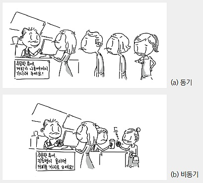

#동기(Synchronous)/비동기(Asynchronous)

* **차이점**
* **정의 및 특징**

##차이점

동기, 비동기의 원래 의미는 통신에서 상대방의 일정 신호에 의해서 다음 동작이 이루어지면 **동기**, 상대방의 상태와 관계없이 일방적으로 동작하면 **비동기** 이다.

즉, 상대방이 받을준비 됐다는 신호를 받아서 한byte 보내고,수신측에서 한byte받은 후 또 보내도 된다는 신호를 보내고 이 신호 확인후 보내고.. 이런식이 **동기식**이다.<br>
이에 반하여 **비동기**에서는 일단 한번 전송 시작되면 좌~~~악 보낸다.

이와 비슷한 개념으로 일반 software에서 동기식이라 함은 어떤 루틴을 완전히 끝내고 제어를 반납하면 **동기식**, 동작이 안 끝났어도 일단 제어권을 반납한 후 지 할일 계속하면 **비동기식**이다.

이게 무슨 말이냐 하면, 예를 들어 siren 소리를 낼때<br>

```md
play_sound("siren.wav","동기")
a=b+c;
..

이러면 사이렌 소리가 다 끝난후 a=b+c가 실행되고

play_sound("siren.wav","비동기")
a=b+c;
..

이러면 a=b+c 이하 프로그램을 계속 수행하면서 siren소리가 납니다.
```

file조작에서도 이와 마찬가지이다.<br>
즉 file조작이 완전히 끝난후 다음 동작이 이루어지는 방식이 **동기식**, 다음 code를 진행하면서 file조작을 하면 **비동기식**이다.

이러한 비동기식은 DOS같은 단일 운영체제에서는 근본적으로 불가능하고 windows같은 multi task 환경에서만 가능하다. file조작에서는 cpu속도와 hard,floppy등의 저장매체와는 엄청난 속도 차이가 있기 때문에 비동기로 처리해도 대용량 data를 read/write 할때는 일시적으로 system 이 버벅이게 된다 .

일반적으로 windows와 같은 multi task 환경에서 동기식 처리는 시스템 효율을 저하 시킨다.
동기식에서는 어떤일을 처리할동안 다른 프로그램은 정지하게 되므로 실제 cpu가 느려지는 것은 아니지만 시스템 전체적으로는 효율이 저하된다 할 수 있다.

**[아래 그림은 동기/비동기에 대한 차이를 한 번에 알 수 있도록 표현한 그림]**
<br/>
-참고 : http://bluekms21.blog.me/10171193149

##정의 및 특징
###정의
**_동기 방식_**이란, 작업이 들어온 순서에 맞게 차근차근 하나씩 진행되는 것이다. 반면에 **_비동기 방식_**은 실행 함수가 끝난 뒤 되돌아오는 반환 함수, 즉 콜백 함수를 활용하여 일 처리 순서를 제어하는 것이다. a, b, c함수가 순서대로 있다고 가정하자. 콜백 함수를 사용하면 a->b->c 혹은 a->c->b 순서처럼 개발자가 원하는 대로 시점을 제어할 수 있다. 예를 들어 페이스 북에 댓글을 달 때, 페이지 새로고침을 하지 않는다든가, 대용량 페이지를 로드할 때 프로세스 진행 상황을 프로그래스바 혹은 모래시계 아이콘으로 보여준다든가 하는 방식으로 말이다.

###특징
**_동기 방식_**은 순서에 맞게 빨리빨리 진행되는 장점이 있지만, 여러 가지의 일을 동시에 처리할 수 없는 단점이 있다. 이러한 점이 자바스크립트 비동기 방식의 탄생 배경이라 짐작된다. **_비동기 방식_**은 여러가지 일을 한꺼번에 처리할 수 있지만, 동기 방식보다 처리 속도가 조금 떨어질 수도 있다.

###예시
```javascript
httpRequest.open("GET", "/text.txt", true); // -> true의 인자값은 비동기 방식으로 호출
httpRequest.send(null);
 
...
 
간단한 코드를 보면서 다시 살펴보자.
   <script type="text/html">
        var httpRequest = null;
 
        function processEvent() {
              httpRequest = getXMLHttpRequest();
              httpRequest.onreadystatechange = callbackFunction;
              httpRequest.open("GET", "/test.jsp", true);
              httpRequest.send(null); // 비동기 방식 -> send() 함수 호출 후 바로 callSome(); 코드를 실행
              callSome();
       }
       <input type="button" onclick="processEvent()" >
   </script>
```
   
**동기 방식**은 send()함수가 호출되면, 서버와의 통신이 완전히 완료된 이후에 send() 함수 이후의 코드가 실행하는 것이다. 만약 ```md httpRequest.open("GET", "/test.jsp", false); ```라고 코딩을 하면, 서버와의 통신이 완전히 종료된 이후에 callSome() 함수가 호출된다는 거다.

**비동기 방식**은 send() 함수가 호출된 뒤 곧바로 다음의 코드가 실행되는 것이다. 위의 코드를 예로 보면 send() 함수가 호출된 뒤에 서버와의 통신 진행 상태에 상관없이 callSome() 함수가 호출된다는 것이다.

##참고
[차이점- http://blog.naver.com/lifesoft/30015652725][차이점]
[차이점]:http://blog.naver.com/lifesoft/30015652725
[정의 및 특징- http://apple77y.tistory.com/11][정의 및 특징]
[정의 및 특징]:http://apple77y.tistory.com/11
[예시- http://apple77y.tistory.com/11][예시]
[예시]:http://funny7103.blog.me/90027301799

#실무에 자주 쓰이는 함수1

* **타이머함수**
    - setTimeout(function,millisecond)
    - setInterval(function,millisecond)
    - clearTimeout(id)
    - clearInterval(id)
    - setTimeout과 setInterval의 차이점 (중요함)

##타이머함수 (window 객체의 타이머 메서드)

window 객체는 아래 표의 타이머 메서드를 갖는다.

|메서드 이름| 설명|
| :------------ | :------------|
|setTimeout(funtion, millisecond) |일정 시간 후에 함수를 한 번 실행한다.|
|setInterval(funtion, millisecond) |일정 시간마다 함수를 반복해서 실행한다.|
|clearTimeout(id) |일정 시간 후에 함수를 한 번 실행하는 것을 중지한다.|
|clearlnterval(id) |일정 시간마다 함수를 반복하는 것을 중단한다.|

타이머 메서드는 특정 시간에 특정 함수를 실행하게 하는 메서드이다.<br/>
**setTimeout() 메서드**는 특정 시간 후에 함수를 한 번 실행하고,<br/>
**setInterval() 메서드**는 특정 시간마다 함수를 실행한다.<br/>

**setTimeout() 메서드**는 한 번만 실행하므로 특별히 주의할 사항이 없지만, <br/>
**setInterval() 메서드**는 지속적으로 실행하므로 지속적으로 메모리를 차지하므로 주의해야 한다.  

타이머를 멈추려면 clearTimeout() 메서드와 clearInterval() 메서드를 사용한다.<br/>
setTimeout() 메서드와 setInterval() 메서드를 사용하면 **아이디를 리턴**하는데,<br/>
이 타이머 아이디를 **clearTimeout() 메서드**와 **clearInterval() 메서**드의 매개 변수에 넣어주면 타이머를 정지 할 수 있다.

**[아래 그림은 setTimeout() 메서드와 setInterval() 메서드의 차이를 나타낸 그림]**


###예시

* **타이머 메서드**

```javascript
<script>
  //윈도우가 로드될 때
  window.onload = function (){
    alert('3초 후 이 페이지는 종료됩니다.');
    // 3초 후에 함수를 실행한다.
    window.setTimeout(function (){
      window.open('about:blank', '_self').close();
    }, 3000);
  }
</script> 
```
[==>CodePen 예시](http://codepen.io/lseeee/pen/RrNNoO)

* **타이머 정지 메서드**

```javascript
<script>
  //윈도우가 로드될 때
  window.onload = function (){
  // 1초마다 함수를 실행한다.
  val intervalID = setInterval(function (){
        document.body.innerHTML += '<p>' + new Date() + '</p>';
      },1000);
    
    // 10초 후에 함수를 실행한다.
    setTimeout(function (){
    //타이머를 종료한다.
      clearInterval(intervalID);
    }, 10000);
  }
</script> 
```

##참고
[모던 웹을 위한 JavaScript jQuery 입문/윤인성 지음/한빛미디어 출판]
